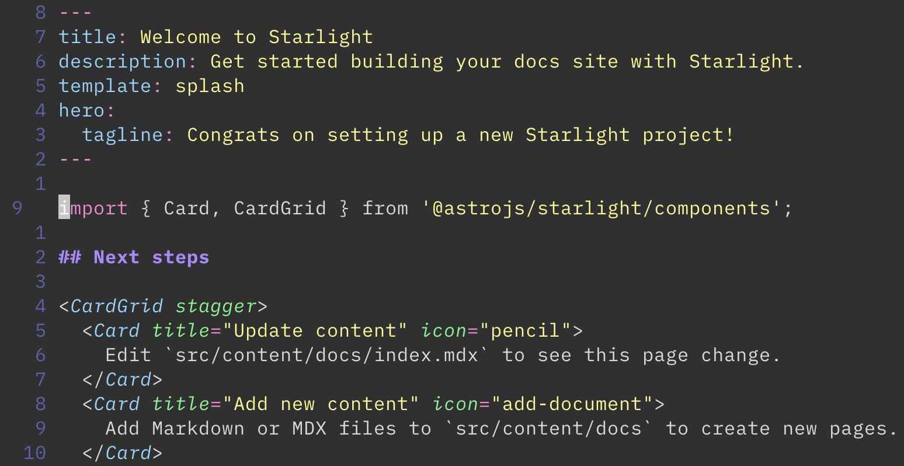

## MDX Syntax highlighting for VIM

[mdx][] syntax highlighting. Fork of [vim-mdx-js][]. With *jaaqo's* [modification suggestions][].



**All pull requests are welcome.**

## Installation

Use your favorite package manager
([vim-plug](https://github.com/junegunn/vim-plug),
[Vundle](https://github.com/VundleVim/Vundle.vim),
[pathogen.vim](https://github.com/tpope/vim-pathogen)),
or add this directory to your Vim runtime path.

For example, if you're using vim-plug, add the following line to `~/.vimrc`:

```
Plug 'nake89/vim-mdx-js'
```

[mdx]: https://github.com/mdx-js/mdx
[vim-jsx]: https://github.com/mxw/vim-jsx
[vim-mdx-js]: https://github.com/jxnblk/vim-mdx-js
[modification suggestions]: https://github.com/jxnblk/vim-mdx-js/issues/3#issuecomment-968229863
